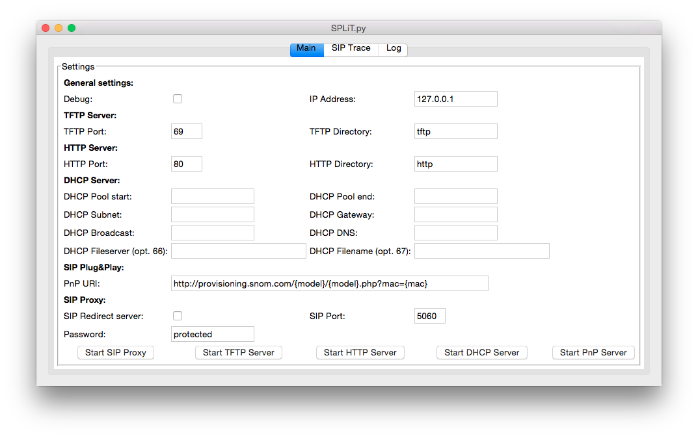
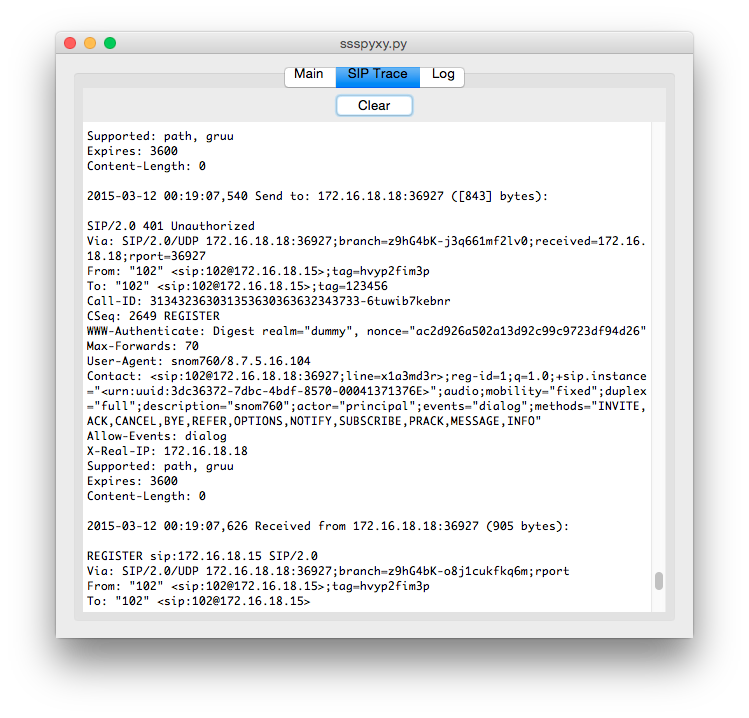
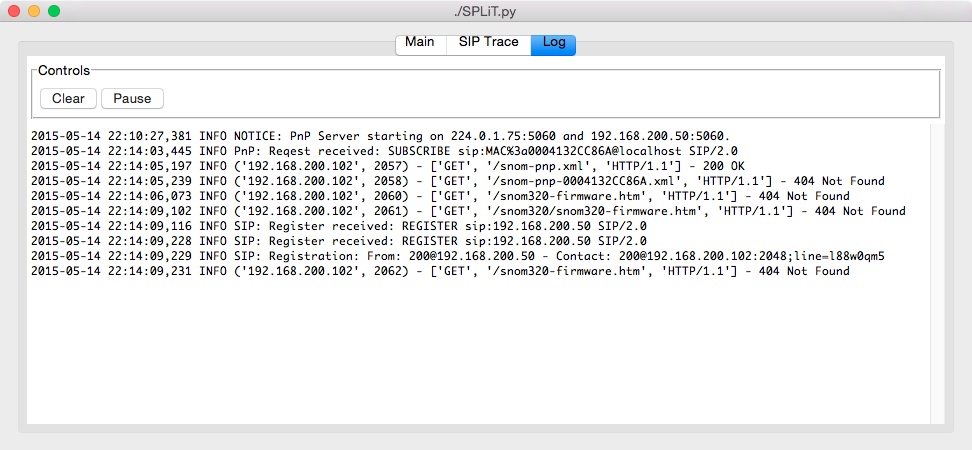

# SPLiT SIP Phone Learning Tool

SPLiT is a **very simple**, **not performant**, **insecure**, and **non fully RFC compliant** SIP stateless proxy, DHCP, TFTP and HTTP server.

There are a lot of very good SIP proxies out there, don't try to use SPLiT in a production/working environment.

SPLiT is developed with hackability in mind, the main target is to reproduce SIP issues, or training / learning purpose.

## Main features

- SIP Registrar with challenge authentication
- SIP Stateless Proxy or Redirect server mode
- SIP UDP only suppport
- SIP custom headers (via CLI only at the moment)
- Embedded SIP Multicast Plug&Play provisioining server
- Embedded DHCP server with 66 and 67 options support
- Embedded HTTP server
- Embedded TFTP server
- Self contained and portable: tested on OS-X, Linux, Windows
- TKinter GUI interface

## Installation

- You need the **Python 2.7** (Python 3 isn't supported yet) interpreter already installed, you can find on the Python [website](http://www.python.org)
- Download the last release archive file from [https://github.com/pbertera/SPLiT/releases](https://github.com/pbertera/SPLiT/releases) and save in your computer
- Run the script from a terminal (or a cmd.exe prompt in Windows)

## Usage

In order to run SPLiT you need Python installed, (tested on 2.7.8 only at the moment), you can start the server from command line:

    pietro$ python SPLiT.py -d -i 172.16.18.14 -P protected
    2015-03-06 15:38:00,155 INFO Starting proxy at Fri, 06 Mar 2015 15:38:00 
    2015-03-06 15:38:00,155 DEBUG Using the Record-Route header: Record-Route: <sip:172.16.18.14:5060;lr>
    2015-03-06 15:38:00,155 DEBUG Using the top Via header: Via: SIP/2.0/UDP 172.16.18.14:5060
    2015-03-06 15:38:00,156 DEBUG Writing SIP messages in sip.log log file
    2015-03-06 15:38:00,156 DEBUG Authentication password: protected
    2015-03-06 15:38:00,156 DEBUG Logfile: None
    2015-03-06 15:38:00,157 INFO Starting serving SIP requests on 172.16.18.14:5060, press CTRL-C for exit.

On windows (in a cmd.exe prompt):

    c:\Python27\Python.exe  SPLiT.py -d -i 172.16.18.14 -P protected
    2015-03-06 15:38:00,155 INFO Starting proxy at Fri, 06 Mar 2015 15:38:00 
    2015-03-06 15:38:00,155 DEBUG Using the Record-Route header: Record-Route: <sip:172.16.18.14:5060;lr>
    2015-03-06 15:38:00,155 DEBUG Using the top Via header: Via: SIP/2.0/UDP 172.16.18.14:5060
    2015-03-06 15:38:00,156 DEBUG Writing SIP messages in sip.log log file
    2015-03-06 15:38:00,156 DEBUG Authentication password: protected
    2015-03-06 15:38:00,156 DEBUG Logfile: None
    2015-03-06 15:38:00,157 INFO Starting serving SIP requests on 172.16.18.14:5060, press CTRL-C for exit.
    
### Command line options

    pietro$ python SPLiT.py -h
    Usage: SPLiT.py [OPTIONS]
    
    Options:
        -h, --help            show this help message and exit
        -t                    Run in terminal mode (no GUI)
        -d                    Run in debug mode
        -i IP_ADDRESS         Specify ip address to bind on (default: 127.0.0.1)
        -l LOGFILE            Specify the log file (default: log to stdout)
        --sip-redirect        Act as a redirect server
        --sip-port=SIP_PORT   Specify the UDP port (default: 5060)
        --sip-log=SIP_LOGFILE
                              Specify the SIP messages log file (default: log to
                              stdout)
        --sip-expires=SIP_EXPIRES
                              Default registration expires (default: 3600)
        --sip-password=SIP_PASSWORD
                              Authentication password (default: protected)
        --sip-exposedip=SIP_EXPOSED_IP
                        Exposed/Public IP to use into the Record-Route header
        --sip-exposedport=SIP_EXPOSED_PORT
                        Exposed/Public port to use into the Record-Route
                        header
        --sip-customheader=CUSTOM_HEADERS
                        Add a custom SIP header to the forwarded request:
                        <method>:<URI-regex>:<SIP-Header
        --pnp                 Enable the PnP server
        --pnp-uri=PNP_URI     Configure the PnP URL
        --tftp                Enable the TFTP server
        --tftp-root=TFTP_ROOT
                              TFTP server root directory (default: tftp)
        --tftp-port=TFTP_PORT
                              TFTP server port (default: 69)
        --http                Enable the HTTP server
        --http-root=HTTP_ROOT
                              HTTP server root directory (default: http)
        --http-port=HTTP_PORT
                              HTTP server port (default: 80)
        --dhcp                Enable the DHCP server
        --dhcp-begin=DHCP_BEGIN
                              DHCP lease range start
        --dhcp-end=DHCP_END   DHCP lease range end
        --dhcp-subnetmask=DHCP_SUBNETMASK
                              DHCP lease subnet mask
        --dhcp-gateway=DHCP_GATEWAY
                              DHCP lease gateway
        --dhcp-dns=DHCP_DNS   DHCP lease DNS
        --dhcp-bcast=DHCP_BCAST
                              DHCP lease broadcast
        --dhcp-fileserver=DHCP_FILESERVER
                              DHCP lease fileserver IP (option 66)
        --dhcp-filename=DHCP_FILENAME
                              DHCP lease filename (option 67)
        --dhcp-leasesfile=DHCP_LEASESFILE
                              DHCP leases file store

The arguments *--sip-exposedport* and *--sip-exposedip* allows you to configure the *Record-Route* added to the forwarded request.

## Adding custom headers

Using the switch *--sip-customheader* you can add one or more SIP headers to forwarded requests, you can filter on the SIP method and the destination URI.
The *--sip-customheader* value is a strig composed by 3 token separated by the *:* character:

- first token represent the SIP method (use * to match all)
- second token must contain a valid regex, the regex is evaluated against the request SIP URI
- the third token contains the SIP header (header name + header value)

### Example:

    ./SPLiT.py -i 172.16.18.15 -d -t --sip-customheader="INVITE:^.{4,}@.*$:Alert-Info: <http://www.notused.com>;info=alert-external" --sip-customheader="INVITE:^.{3,3}@.*$:Alert-Info: <http://www.notused.com>;info=alert-internal" --sip-customheader="*:.*:X-Forwarded-from: SPLiT Proxy"

Using this command SPLiT will:

- add the custom header *Alert-Info: <http://www.notused.com>;info=alert-external* only to the *INVITE* requests sent to all the SIP URI with len greater or equal to 4.
- add the custom header *Alert-Info: <http://www.notused.com>;info=alert-internal* only to the *INVITE* requests sent to all the SIP URI with len lesser than 3.
- add the custom header *X-Forwarded-from: SPLiT Proxy* to all the requests sent to all the SIP URI

# Screenshots

**Main tab:**

**SIP trace:**

**Log messages:**

## Known issues

This tool is designed for training and debugging purpose only, HTTP and TFTP server doesn't check requests against "path walking" attacks, in order to open a DHCP or TFTP socket the tool must run with admin privileges.
**Please use it only in trusted environments**

## TODO

- [x] PnP server
- [ ]  Embed a syslog server
- [ ]  Ability send arbitrary SIP messages to the peers (check-sync, MESSAGE, etc..)
- [ ]  Python 3 support
